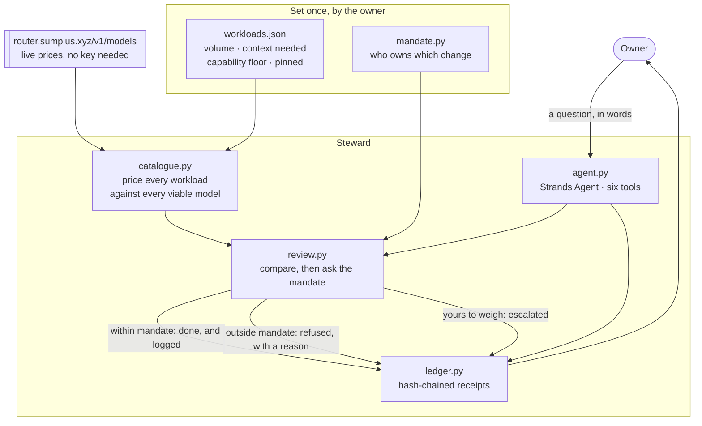

# Sumplus Steward

An agent that looks after what your AI workloads cost, in the background, and
brings you exactly the decisions that are yours.

Built with the **Strands Agents SDK**. Track: **Everyday Agents** (money).

**Live: https://sumplus-steward-production.up.railway.app** — the same review,
rendered for someone who has been sent a link. Loading it runs the review for
real against today's prices. The page is read-only: it applies nothing and
changes no mandate.

## The problem

A team ends up running a handful of AI workloads. Each one was put on a model
once, by someone who has since moved on. Prices change weekly and nobody
re-checks, because re-checking means pricing five workloads against ninety
models and nobody has an afternoon for that.

Two bad endings. Either nobody looks, and the bill grows quietly. Or a tool
looks and forwards everything it finds, and now you have a second inbox.

## What Steward does

It runs the review itself, applies the changes that are plainly inside its
mandate, and surfaces only what a person actually has to weigh in on.

```
$ python run.py

1 decision for you
  contract-review: contract-review is marked quality sensitive. Moving it to
  claude-opus-4-8 saves $60.00 a month and that trade is yours to make.

Steward handled 3 switches on its own, saving $4019.60 a month.
  support-triage: gpt-5.5 to gemini-2.5-flash-lite, $3182.80 a month
  nightly-digest: kimi-k3 to gemini-2.5-flash-lite, $696.60 a month
  code-review-bot: glm-5.2 to MiniMax/MiniMax-M3, $140.20 a month

Left alone (1):
  board-pack: board-pack is pinned, so Steward reports on it and changes nothing.

6 receipts, chain head 794b7f2d7b6a7a06…
```

Those prices are live. The catalogue comes from
`https://router.sumplus.xyz/v1/models`, ninety-odd models with current rates,
and it needs no key:

```bash
curl -s https://router.sumplus.xyz/v1/models | head
```

## Architecture



The Strands agent sits on top, not in the middle. It reads the review and the
receipts and answers questions about them. It never gets a vote on whether a
change was inside the mandate, because that answer has to be the same whichever
model is loaded, and whether or not one is loaded at all.

## The mandate is the product

An agent that asks about everything is a worse inbox. An agent that asks about
nothing is a liability. The line between them is written down in
`steward/mandate.py`, and Steward never argues with it:

| Situation | Who owns it |
|---|---|
| Workload is pinned | Nobody touches it. Steward reports and stops. |
| Destination is not `live` | Refused. Production does not move onto a preview model. |
| Destination has less context than the workload needs | Refused. |
| Saving under $2 a month | Refused. Churn is not worth it. |
| Workload marked quality sensitive | **Yours.** Steward states the saving and waits. |
| Everything else | Steward's, and it does it. |

Each workload also carries a capability floor its owner set once: `light`, `mid`
or `flagship`. Steward will find the cheapest model at or above that floor and
never below it. The bands are fixed dollar boundaries, not quantiles of
whatever is in the catalogue today, because a band that moves with the candidate
list is not a promise anyone can rely on.

## Every decision leaves a receipt

Including the ones where Steward decided to do nothing. A record with the
refusals removed is not a record of the run.

```bash
python run.py --receipts   # the chain, as JSON
python run.py --audit      # recompute it and report
```

Receipts are chained: each commits to its own fields and to the hash of the one
before it. `--audit` recomputes the whole chain from the receipts themselves and
trusts none of the stored hashes.

## Talking to it

The review needs no model at all: the arithmetic is arithmetic and the mandate
is the mandate. The Strands agent is what turns a question into an answer.

```bash
python run.py --ask "what did you change last night and why did you leave board-pack alone?"
```

Six tools, all deterministic, all writing receipts: `review_spend`,
`decisions_for_the_human`, `price_workload`, `cheapest_option`,
`audit_receipts`, `show_mandate`. The model chooses what to look at and how to
say it. It never gets to decide that a change was within mandate.

`build_agent(model=...)` takes any Strands model provider, so the same Steward
runs on Bedrock or anywhere else Strands supports. Leaving the review runnable
without a model is deliberate: a spending control that stops working when a
model is unavailable is not a control.

## Run it

```bash
python3.13 -m venv .venv
.venv/bin/pip install strands-agents strands-agents-tools
.venv/bin/python run.py
.venv/bin/python -m pytest tests -q     # 12 tests
```

## Tests

Twelve tests cover the two places where a bug costs money or hides a change: the
mandate and the ledger. They run against fixed model data, not the live
catalogue, so they say the same thing tomorrow.

The chain test asserts both halves of a break: an edited receipt fails its own
hash **and** the receipt after it fails its link. Asserting only the first would
pass even if links were never checked. That was confirmed by weakening the
verifier on purpose, watching the test go red, and putting it back.

## Notes

- Costs round up and savings round down, so neither number flatters itself.
- Steward changes its own configuration. It does not hold anyone's credentials
  and it does not move money.
